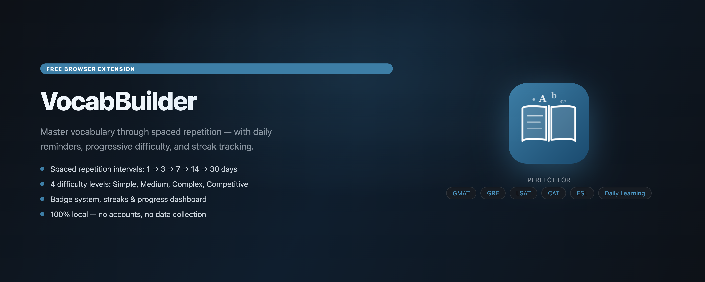
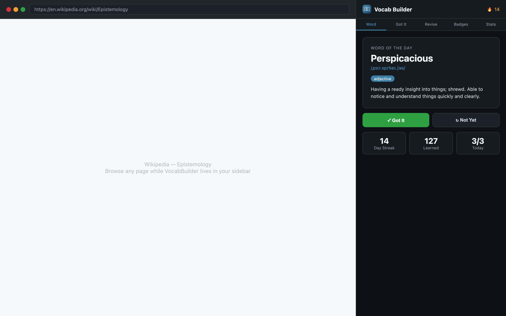
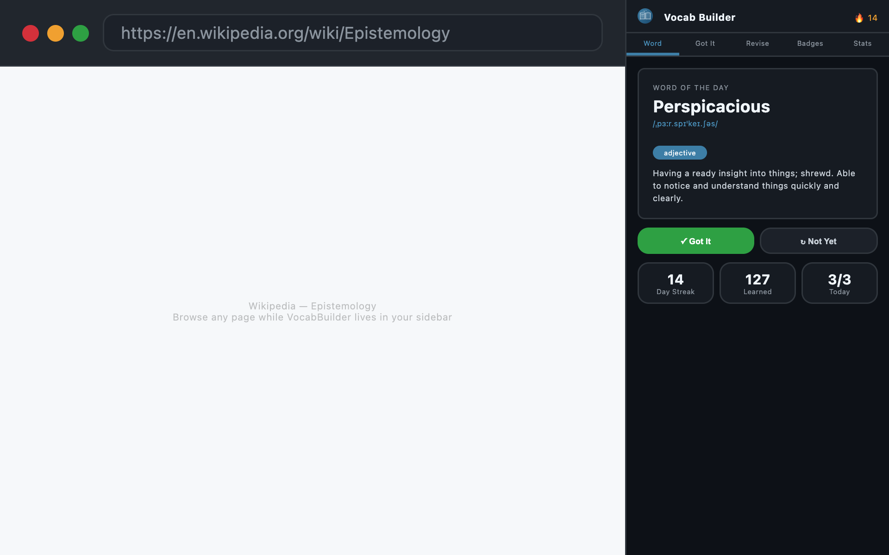

# VocabBuilder

> Master vocabulary through spaced repetition — right in your browser sidebar. Free, open source, and 100% local.

[](https://microsoftedge.microsoft.com/addons/detail/vocabulary-builder)
[](LICENSE)
[](manifest.json)



---

## What it does

VocabBuilder serves you one word per day in a browser side panel and uses **spaced repetition** to schedule reviews at the optimal interval — so words move from short-term to long-term memory efficiently.

Review intervals: **1 → 3 → 7 → 14 → 30 days**

Mark a word **"Got It"** and it advances. Mark it **"Not Yet"** and it comes back sooner. Once a word completes the full cycle it's marked as learned.

---

## Features

| Feature | Details |
|---|---|
| **4 Difficulty Levels** | Simple, Medium, Complex, Competitive (GMAT/GRE/LSAT) |
| **Spaced Repetition** | Progressive 1→3→7→14→30 day review intervals |
| **Daily Reminders** | 9 AM browser notification if you haven't reviewed |
| **Streak Tracking** | Current streak, longest streak, streak-break warning |
| **Badge System** | Streak badges (3/7/30/365 days) + word milestone badges |
| **Progress Dashboard** | Daily goal, monthly totals, words learned, words in review |
| **Rich Word Cards** | IPA pronunciation, etymology, synonyms, antonyms, example sentences |
| **100% Local** | All data stored in Chrome Storage API — no accounts, no tracking |

---

## Screenshots

| Side Panel | Compact View |
|---|---|
|  |  |

---

## Installation

### From the Edge Add-ons Store
[Install VocabBuilder from Edge Add-ons →](https://microsoftedge.microsoft.com/addons/detail/vocabulary-builder)

### Load unpacked (development)
```bash
git clone https://github.com/zozimustechnologies/vocabbuilder.git
```
1. Open `edge://extensions`
2. Enable **Developer mode**
3. Click **Load unpacked** → select the repo folder

---

## Project Structure

```
vocabbuilder/
├── background/
│   └── service-worker.js     # Alarms, notifications, badge updates
├── data/
│   ├── words.js               # Word list (all difficulty levels)
│   ├── badges.js              # Badge definitions & award logic
│   ├── dictionary-api.js      # Free Dictionary API integration
│   └── wordlist.js            # Word ID helpers
├── sidepanel/
│   ├── sidepanel.html         # Side panel UI
│   ├── sidepanel.css          # Styles
│   └── sidepanel.js           # App logic
├── icons/                     # Extension icons (16–1024px)
├── storeassets/               # Edge store listing assets & description
├── docs/                      # GitHub Pages site
├── tests/
│   └── validate-words.js      # Word list validation
├── manifest.json              # Manifest V3
└── generate-storeassets.js    # Puppeteer script to regenerate store images
```

---

## Permissions

| Permission | Reason |
|---|---|
| `storage` | Saves progress, streaks, and word history locally |
| `alarms` | Schedules daily review reminders |
| `notifications` | Sends the daily reminder and streak-warning notifications |
| `sidePanel` | Opens the extension in the browser sidebar |

No host permissions are used for user data. The only external request is to [dictionaryapi.dev](https://dictionaryapi.dev/) for word definitions — no user data is transmitted.

---

## Privacy

- No accounts required
- No analytics or telemetry
- No data collected or transmitted
- All storage is local via `chrome.storage.local`
- Open source — audit every line on GitHub

---

## Development

```bash
# Validate word list
node tests/validate-words.js

# Regenerate store assets (requires puppeteer)
node generate-storeassets.js
```

---

## Contributing

1. Fork the repo
2. Create a feature branch: `git checkout -b feature/my-feature`
3. Commit your changes
4. Open a pull request

---

## License

[MIT](LICENSE) — © Zozimus Technologies

---

## Links

- **Website:** https://zozimustechnologies.github.io/vocabbuilder
- **Edge Add-ons:** https://microsoftedge.microsoft.com/addons/detail/vocabulary-builder
- **GitHub:** https://github.com/zozimustechnologies/vocabbuilder
- **Donate:** https://wise.com/pay/business/sandeepchadda
